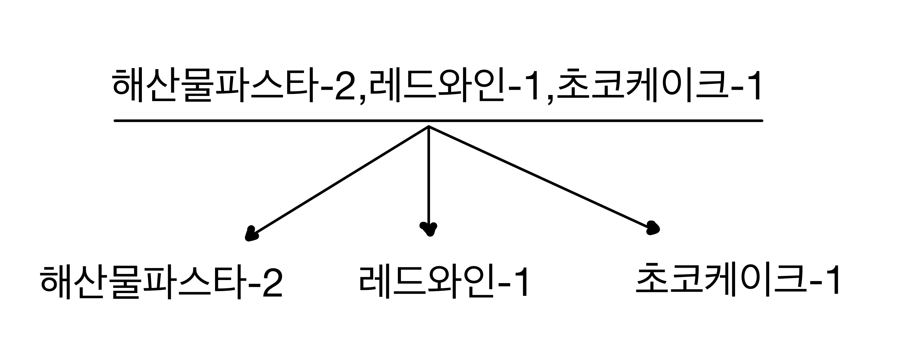
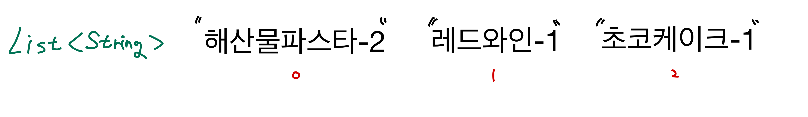
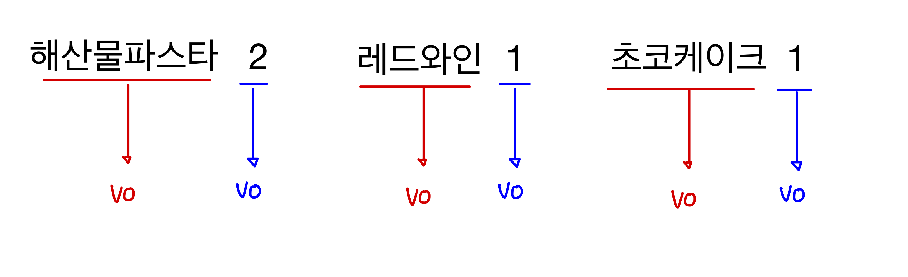
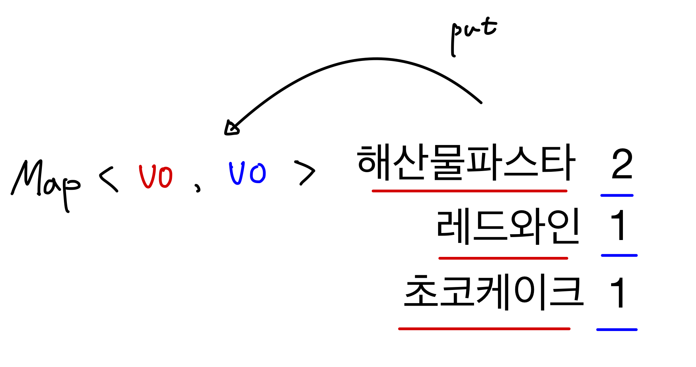

# 💡프로그래밍 요구사항

### 추가된 요구 사항

- 아래 있는 `InputView`, `OutputView` 클래스를 참고하여 입출력 클래스를 구현한다.
    - 입력과 출력을 담당하는 클래스를 별도로 구현한다.
    - 해당 클래스의 패키지, 클래스명, 메서드의 반환 타입과 시그니처는 자유롭게 구현할 수 있다.

      ```java
      public class InputView {
          public int readDate() {
              System.out.println("12월 중 식당 예상 방문 날짜는 언제인가요? (숫자만 입력해 주세요!)");
              String input = Console.readLine();
              // ...
          }
          // ...
      }
      ```

      ```java
      public class OutputView {
          public void printMenu() {
              System.out.println("<주문 메뉴>");
              // ...
          }
          // ...
      }
      ```

---

# 💡기능 요구 사항 정리

### 메뉴

```
<애피타이저>
양송이수프(6,000), 타파스(5,500), 시저샐러드(8,000)

<메인>
티본스테이크(55,000), 바비큐립(54,000), 해산물파스타(35,000), 크리스마스파스타(25,000)

<디저트>
초코케이크(15,000), 아이스크림(5,000)

<음료>
제로콜라(3,000), 레드와인(60,000), 샴페인(25,000)

```

- 할인
    - 중복된 할인 + 증정
        - 디데이 할인 : 1000원으로 시작해서 할인금액이 100원씩 증가한다.
        - ex) 12월 1일 1000원, 2일에 1100원, 25일엔 3400원
            - 이벤트 기간 : 할인은 12월 1일부터 25일까지
        - 평일 할인 (일요일~목요일) : 디저트 메뉴를 메뉴 1개당 2023원 할인
        - 주말 할인 (금요일,토요일) : 메인 메뉴를 메뉴 1개당 2023원 할인
        - 특별 할인 : 이벤트 달력에 별이 있으면 총 주문 금액에서 1000원 할인
        - 증정 이벤트 : 할인 전 총 주문 금액 >= 120,000원 ▶︎ 샴페인 1개증정
            - 이벤트 기간 : '디데이 할인'을 제외한 모든 이벤트는 12월 1일 ~ 31일까지 적용


- 이벤트 배지
    - 5000원 이상 ▶︎ 별
    - 1만원 이상 ▶︎ 트리
    - 2만원 이상 ▶︎ 산타


- 주의 사항
    - 총 주문 금액 >= 10,000원 부터 이벤트 적용
    - 음료만 주문 시 주문 불가능.
    - 메뉴는 한 번에 최대 20개까지만 주문 가능.
        - (e.g. 시저샐러드-1, 티본스테이크-1, 크리스마스파스타-1, 제로콜라-3, 아이스크림-1의 총개수는 7개)


- 출력
    - "12월 중 식당 예상 방문 날짜는 언제인가요? (숫자만 입력해 주세요!)"
        - 방문할 날짜는 1 이상 31 이하의 숫자
        - 1 이상 31 이하의 숫자가 아닌 경우, "[ERROR] 유효하지 않은 날짜입니다. 다시 입력해 주세요."라는 에러 메시지 출력
    - "주문하실 메뉴와 개수를 알려 주세요. (e.g. 해산물파스타-2,레드와인-1,초코케이크-1)"
        - 메뉴판에 없는 메뉴를 입력하는 경우, "[ERROR] 유효하지 않은 주문입니다. 다시 입력해 주세요."라는 에러 메시지 출력
        - 메뉴의 개수는 1 이상의 숫자만 입력되도록 해주세요. 이외의 입력값은 "[ERROR] 유효하지 않은 주문입니다. 다시 입력해 주세요."라는 에러 메시지 출력
        - 메뉴 형식이 예시와 다른 경우, "[ERROR] 유효하지 않은 주문입니다. 다시 입력해 주세요."라는 에러 메시지 출력
        - 중복 메뉴를 입력한 경우(e.g. 시저샐러드-1,시저샐러드-1), "[ERROR] 유효하지 않은 주문입니다. 다시 입력해 주세요."라는 에러 메시지 출력
    - 주문 메뉴의 출력 순서는 자유롭게 출력 가능
    - 총혜택 금액에 따라 이벤트 배지의 이름을 다르게 출력
        - 총혜택 금액 = 할인 금액의 합계 + 증정 메뉴의 가격
    - 할인 후 예상 결제 금액 = 할인 전 총주문 금액 - 할인 금액
    - 증정 메뉴
        - 증정 이벤트에 해당하지 않는 경우, 증정 메뉴 "없음"으로 출력
    - 혜택 내역
        - 적용된 이벤트 내역’만’ 출력
        - 적용된 이벤트가 없다면 혜택 내역 "없음"으로 출력
        - 혜택 내역에 여러 개의 이벤트가 적용된 경우, 출력 순서는 자유롭게 출력가능
    - 이벤트 배지
        - 이벤트 배지가 부여되지 않는 경우, "없음"으로 출력

---

# 💡 구현 기능 목록

# 🚩 1. View

## ✍🏻 **입력**

- 식당 방문 날짜 (1~31 사이의 숫자)
    - 유효성 검증 : 문자를 입력한 경우 “[ERROR] 유효하지 않은 날짜입니다. 다시 입력해 주세요.” 에러메시지를 출력한다.
- 주문할 메뉴와 개수
    - Console.readLine()의 리턴타입이 String이므로, 별도의 유효성 검증은 이루어지지 않는다.

추가된 프로그래밍 요구사항에 맞게 InputView 클래스에서 입력값에 대한 안내문 출력이 이루어진다.

## 🖨️ 출력

- 주문 메뉴
    - 주문 메뉴의 출력 순서는 자유롭게 출력

```markdown
<주문 메뉴>
티본스테이크 1개
바비큐립 1개
초코케이크 2개
제로콜라 1개  
```

- 할인 전 총 주문 금액

```markdown
<할인 전 총주문 금액>
142,000원
```

- 증정 메뉴
    - 증정 이벤트에 해당하지 않는 경우, 증정 메뉴 "없음"으로 출력

```markdown
- 증정메뉴를 받은 경우
  <증정 메뉴>
  샴페인 1개

- 증정메뉴를 받지 못한 경우
  <증정 메뉴>
  없음
```

- 혜택 내역 : 적용된 할인 정보와 할인받은 가격 출력
    - 혜택을 받은 경우 ‘받은 혜택’에 대해서만 출력
    - 혜택을 받지 못한 경우 “없음” 출력

```markdown
<혜택 내역>
크리스마스 디데이 할인 : -1,200원
평일 할인: -4,046원
특별 할인: -1,000원
증정 이벤트: -25,000원

<혜택 내역>
없음
```

- 총 혜택 금액 : 할인받은 가격 + (증정 메뉴를 받은 경우 증정 메뉴의 가격)

```markdown
- 혜택을 받은 경우
  <총 혜택 금액>
  -31,246원

- 혜택을 받지 못한 경우
  <총 혜택 금액>
  0원
```

- 할인 후 예상 결제 금액 : 할인 전 총주문 금액 - 할인 금액

```markdown
<할인 후 예상 결제 금액>
135,754원
```

- 12월 이벤트 배지
    - 이벤트 배지가 부여되지 않은 경우, “없음” 출력

```markdown
<12월 이벤트 배지>
산타
```

---

# 🚩 2. 입력 값에 대한 유효성 검증/변환

## 🔎 검증

- 사용자가 입력한 방문 날짜가 ‘숫자’인지 유효성을 검증하는 클래스
    - 검증에 실패한 경우 커스텀한 예외가 발생하여 “`[ERROR] 유효하지 않은 날짜입니다. 다시 입력해 주세요."` 예외 메시지가 출력된다.

## 🔄 변환

사용자가 입력한 주문에 대한 String을 변환하는 기능을 가진 클래스

1. Slicing : “,”을 기점으로 (주문메뉴-주문수량)으로 입력받은 String을 슬라이싱한다.



2. 슬라이싱한 값들을 List<String> 컬렉션 형태로 저장한다.



3. Mapping : List에 있는 값들을 “-”을 기점으로 나누어 원시값을 포장한 VO 객체로 만든다.



4. Map에 담는다.




---

# 🚩 3. Value Object

- “사용자가 입력한 값”을 파싱하여 불변 객체로 관리한다.
- ➡️ 방문 날짜, 주문한 음식, 주문한 음식의 개수

## 📆 방문 날짜

- 방문 날짜에 대한 원시값을 포장하여 필드로 가진다.
- 사용자가 입력한 값이 1~31 사이인지 검증하여 검증에 성공한 경우 객체가 생성된다.
- 방문 날짜가 주말인지 검사하는 기능을 가진다. for 평일 이벤트, 주말 이벤트 할인 적용
- 방문 날짜가 25일 포함 이전인지 검사하는 기능을 가진다. for 디 데이 이벤트 할인 적용
- 방문 날짜가 스페셜 데이인지 검사하는 기능을 가진다.
    - 방문 날짜가 크리스마스 or 일요일 or 31일인 경우 스페셜 데이
    - 방문 날짜가 크리스마스인지 검사하는 기능을 가진다 for 스페셜 데이 검사
    - 방문 날짜가 일요일인지 검사하는 기능을 가진다 for 스페셜 데이 검사
    - 방문 날짜가 31일인지 검사하는 기능을 가진다 for 스페셜 데이 검사

## 🍗 주문 음식 이름

- 변환 클래스에 의해 생성된 주문 음식의 이름에 대한 원시값을 포장하고 있는 Value Object
- 주문 메뉴에 있는 메뉴인지 검증하여 검증에 통과된 경우 생성자가 동작한다.
    - 검증에 실패할 경우 “[ERROR] 유효하지 않은 주문입니다. 다시 입력해 주세요.” 메시지가 출력되고 생성자가 동작하지 않는다.
- 주문 음식이 음료 카테고리의 음식인지 검사하는 기능을 가진다. for 주문에 대한 모델 생성에서 ‘모든’ 음식이 음료 카테고리인지 검증
- 음식의 필드 값이 동일하면 두 음식은 동일 객체로 취급한다. for 주문에 대한 모델 생성에서 ‘중복’ 음식이 존재하는지 검증

## ☝🏻 주문 음식 개수

- 변환 클래스에 의해 생성된 주문 음식의 개수에 대한 원시값을 포장하고 있는 Value Object
- 값이 0인지 검증하여 검증에 통과된 경우 생성자가 동작한다.
    - 검증에 실패할 경우 “[ERROR] 유효하지 않은 주문입니다. 다시 입력해 주세요.” 메시지가 출력되고 생성자가 동작하지 않는다.

---

# 🚩 4. Model

## 🔖 메뉴

- 판매하는 메뉴

```
<애피타이저>
양송이수프(6,000), 타파스(5,500), 시저샐러드(8,000)

<메인>
티본스테이크(55,000), 바비큐립(54,000), 해산물파스타(35,000), 크리스마스파스타(25,000)

<디저트>
초코케이크(15,000), 아이스크림(5,000)

<음료>
제로콜라(3,000), 레드와인(60,000), 샴페인(25,000)

--------------------------------------------------
APPETIZER(Map.of("양송이수프", 6000,
        "타파스", 5500,
        "시저샐러드", 8000)),
MAIN(Map.of(
        "티본스테이크", 55000,
        "바비큐립", 54000,
        "해산물파스타", 35000,
        "크리스마스파스타", 25000)),
DESSERT(Map.of(
        "초코케이크", 15000,
        "아이스크림", 5000)),
DRINK(Map.of(
        "제로콜라", 3000,
        "레드와인", 60000,
        "샴페인", 25000));

```

- 에피타이저, 메인, 디저트, 음료 네 가지 카테고리로 구성되어 있으며, 각 카테고리에는 판매하는 음식과 음식의 가격이 책정되어 있다.
- Enum을 활용하여 각 카테고리를 만들고, 음식의 이름과 가격에 대한 정보는 Map을 활용

## 📝 주문

- 사용자가 입력한 주문 정보 String을 변환을 거쳐 생성된 Map을 토대로 생성된다.
- 즉, 사용자가 입력한 “주문 정보”는 Map 필드로 가진다.
- 만들어진 주문 정보에 대한 검증을 거친다.
    - 주문량의 총 합이 20 초과인지 검증
    - 주문정보에 ‘음료’만 포함되어 있는지 검증
    - 검증 실패 시 커스텀된 예외를 던지고 요구사항에 따른 에러 메시지를 던진다.
- “주문 정보”를 토대로 할인 정보를 생성할 때 필요한 “디저트 메뉴의 주문량”과, “메인 메뉴의 주문량”을 계산하여 리턴하는 기능을 가진다. for 할인 정보 생성
- “주문 정보”를 토대로 주문 음식 가격의 총 합을 리턴하는 기능을 가진다. for 증정 상품 생성, 할인 정보 생성

## 🎁 증정 상품

- 증정 상품에 대한 정보

```markdown
"샴페인 1개" - 최소 주문 금액 120000, 증정 상품 가격 - 25000
"없음" - 최소 주문 금액 0, 증정 상품 가격 - 0

ONE_CHAMPAGNE("샴페인 1개", 120000, 25000),
NONE_GIFT("없음", 0, 0);
```

- 증정 상품에 대한 정보는 연관성이 있는 상수이므로 enum으로 관리한다.
- 증정 상품에 대한 이름을 필드로 가진다.
- 주문 정보로부터 주문 음식 가격의 총합에 대한 메시지를 전달받아 증정 상품을 생성한다.
    - 주문 음식 가격의 총 합이 증정 상품의 최소 요구금액보다 큰 경우 증정 상품의 이름으로 증정 상품을 생성
    - 최소 요구 금액보다 낮은 경우 “없음”이름으로 증정 상품을 생성한다.
    - 증정 상품을 지급받았는지(상품의 이름이 “없음”이 아닌 지)에 대한 여부를 메시지로 리턴하는 기능을 가진다. for 증정 이벤트 할인 정보 생성

## 💸 할인

- 사용자가 적용받은 할인에 대한 정보를 가지는 모델로 아래 세 가지의 클래스와 밀접한 관련이 있다.

### 1. 할인 정책

```markdown
WEEKDAY_DISCOUNT("평일 할인"),
WEEKEND_DISCOUNT("주말 할인"),
D_DAY_DISCOUNT("크리스마스 디데이 할인"),
GIFT_DISCOUNT("증정 이벤트"),
SPECIAL_DISCOUNT("특별 할인");
```

- 할인에 대한 정책을 enum으로 관리한다.

### 2. 할인 가격

- 사용자가 적용받는 할인 가격에 대한 원시값을 포장한 불변 객체

### 3. 할인 금액 정보

```markdown
START_D_DAY_DISCOUNT_AMOUNT(900),
D_DAY_DISCOUNT_AMOUNT(100),
EVENT_ATTEND_MINIMUM_ORDER_AMOUNT(10000),
SPECIAL_DISCOUNT_AMOUNT(1000);
```

- 할인 금액에 대한 연관성이 있는 상수들을 enum으로 관리한다.

- 할인 정책, 할인 금액에 대한 정보를 Map형태의 필드로 가진다
- 주문 모델 객체로부터 ‘주문 총량’, ‘메인 카테고리 주문 총량’, ‘디저트 카테고리 주문 총량’, ‘방문 날짜’, ‘증정 상품 지급 여부’에 대한 메시지를 받아 할인 정보를 생성한다.
    - 증정 이벤트에 대한 할인 정보 → ‘증정상품지급여부’에 대한 메시지를 통해 생성
    - 스페셜 할인 정보 → ‘방문 날짜’가 스페셜 데이인 경우 생성
    - 크리스마스 디 데이 할인 정보 → ‘방문 날짜’가 크리스마스 또는 그 이전인 경우 계산하여 생성
    - 주말 할인 정보 → ‘방문 날짜’가 주말인 경우 생성
    - 평일 할인 정보 → ‘방문 날짜’가 평일인 경우 생성
- 증정 이벤트에 대한 할인 금액을 리턴하는 기능을 가진다. for 총 혜택금액 출력
- 할인 받은 총 금액을 계산하여 리턴하는 기능을 가진다. for 뱃지 생성

## 🎖️배지

- 할인 정보 모델로부터 할인 총 금액에 대한 메시지를 전달받아 배지에 대한 정보를 토대로 배지를 생성한다.

### 배지에 대한 정보

- 연관성이 있는 상수들은 enum으로 관리한다.

```markdown
산타 뱃지 - 최소 요구 금액 20000
트리 뱃지 - 최소 요구 금액 10000
별 뱃지 - 최소 요구 금액 5000
없음 - 최소 요구 금액 0

SANTA_BADGE("산타", 20000),
TREE_BADGE("트리", 10000),
STAR_BADGE("별", 5000),
NONE_BADGE("없음", 0);
```

---

# 🚩 5. 커스텀 예외 처리

### 🚫 IllegalArgumentException을 상속받아 구체적인 예외 처리

- 주문과 관련된 예외
    - 주문 형식에 맞지않는 입력인 경우
    - 주문의 음식의 개수가 0인 경우
    - 주문의 음식의 개수의 총량이 20을 초과하는 경우
    - 주문에 메뉴에 없는 음식이 포함된 경우
    - 주문에 음료만 포함된 경우
    - 주문에 중복된 음식이 포함된 경우
- 방문날짜와 관련된 예외
    - 방문 날짜에 문자가 포함된 경우
    - 방문 날짜가 1~31사이의 숫자가 아닌 경우

---

# 🚩 6. 컨트롤러

- 뷰와 모델사이의 매개체

**역할**

1. 입력 뷰로부터 입력값을 받아 방문 날짜와 주문음식, 주문음식 수량에 대한 Value Object를 생성한다.
1. 입력 뷰에 대한 입력값이 유효하지 않거나, Value Object 생성 검증에 통과하지 못한 경우 재입력을 제어한다.
2. 생성된 불변 객체를 토대로 주문 정보, 할인 정보에 대한 모델 생성을 지시한다.
3. 모델로부터 사용자에게 할인 정보, 주문 정보에 대한 메시지를 출력뷰에게 전달한다.
